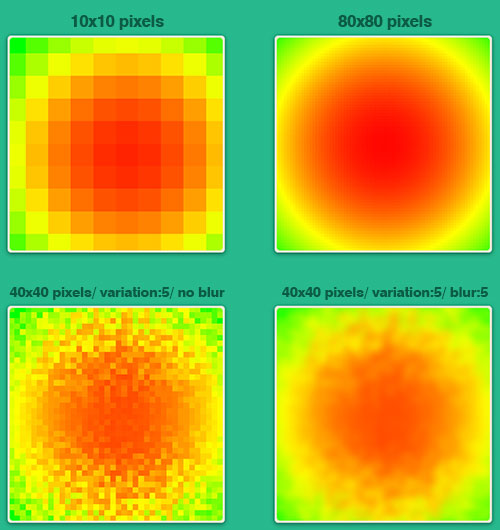

## Demo

You can follow the demo version of the project from the below link:
Note that you can find some options to generate the different heatmap and test it.

[Heatmap demo](https://amin-norollah.github.io/JS-code/Charts/Heatmap/)

## Manual

This project is totally written with JS, CSS and HTML. I used CSS and JS for implementing all effects, which have enhanced the performance. you can easily generate smooth chart with the resolution of 60x60 and 3 pixels of blur effect.

Some of the features of the mosaic art gallery are as follows:

- Without using any library
- Dynamic HTML map creating
- Resolution between 10x10 and 80x80 pixels (increasing the resolution more that 80x80 pixels could affect the performance. However, if you want you can change the limit in the script.js file)
- Enhanced the output heatmap with the power of CSS blur effect
- Responsive
- CSS effects

I tried to make the page look attractive to the user. Feel free to contact me if you have any comments or questions.

> Get in touch with me by [a.norollah.official@gmail.com](mailto:a.norollah.official@gmail.com)

## License

JS-code is licensed under the [MIT license](https://opensource.org/licenses/MIT).
