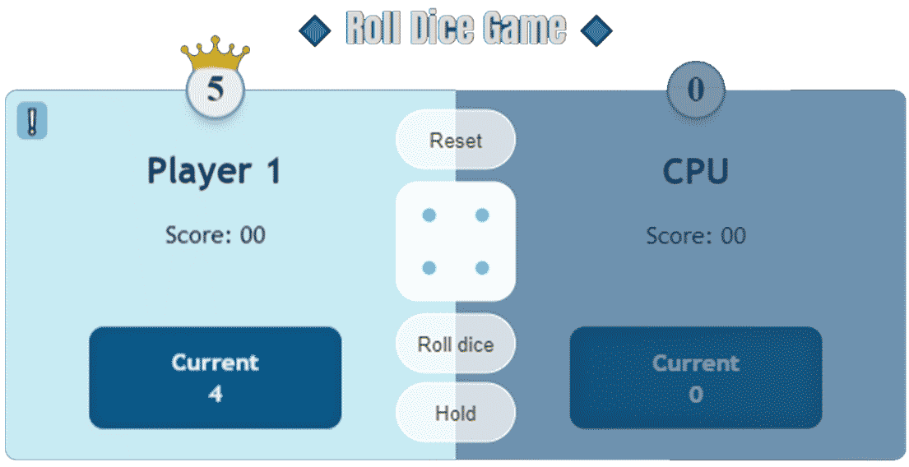

  

## Demo

You can follow the demo version of the project from the below link:

[Roll dice game](https://amin-norollah.github.io/JS-code/Games/RollDice)

## Licence

JS-code is licensed under the [MIT license](https://opensource.org/licenses/MIT).
