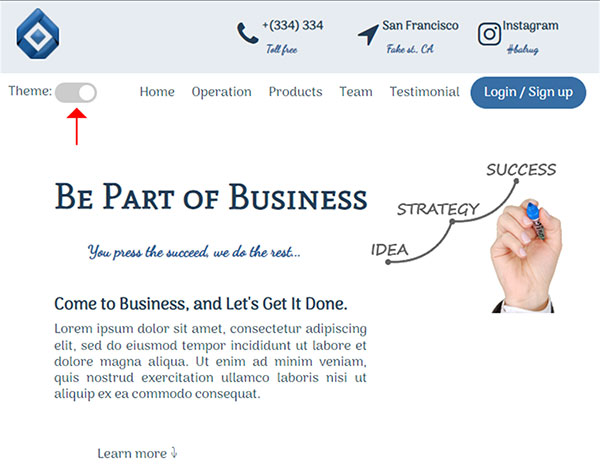

## Demo

You can follow the demo version of the project from the below link:

[Business Webpage demo](https://amin-norollah.github.io/JS-code/Pages/BusinessWebpage/)

## Manual

This project is totally written with JS, CSS and HTML. I used CSS and JS for implementing all effects, which have enhanced the performance. Although the page is easy to follow, I want to mention that there is a theme changer button in the menu as well. The image below shows how to set it:

I tried to make the page look attractive to the user. Feel free to contact me if you have any comments or questions.

> Get in touch with me by [a.norollah.official@gmail.com](mailto:a.norollah.official@gmail.com)

## License

JS-code is licensed under the [MIT license](https://opensource.org/licenses/MIT).
