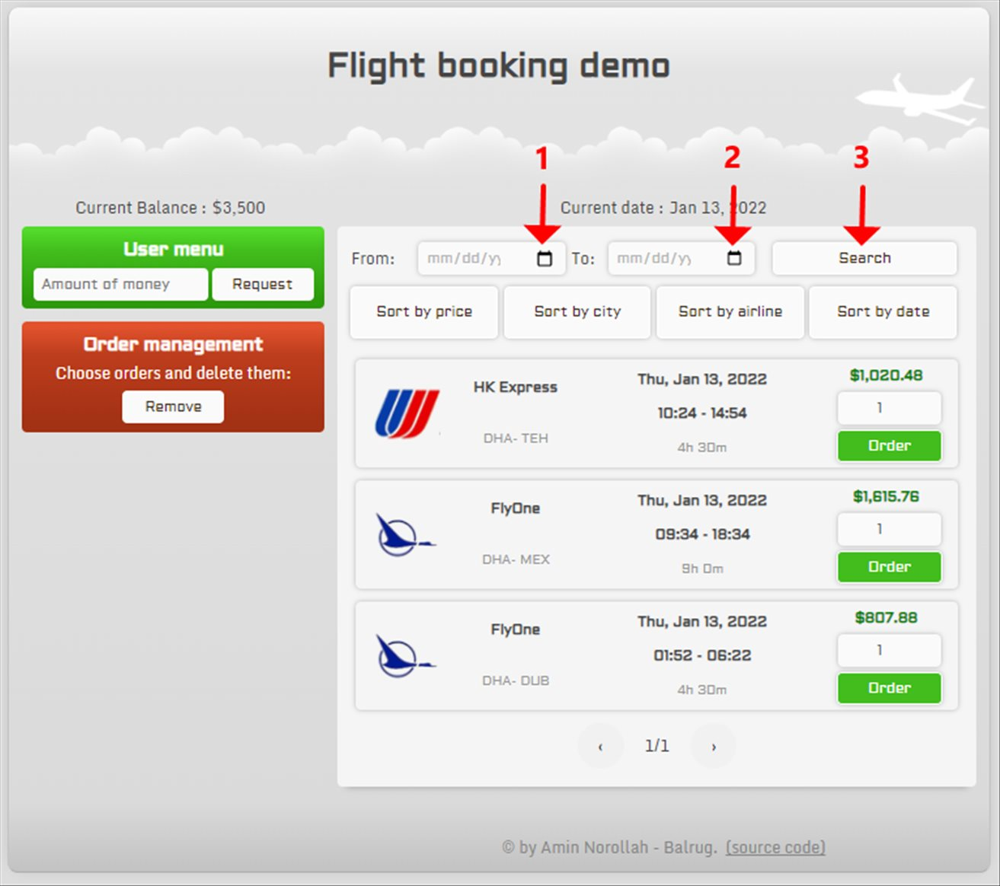

## Demo

You can follow the demo version of the project from the below link:

[Flight booking demo](https://amin-norollah.github.io/JS-code/Pages/FlightBooking/)

## Manual

First of all, it is worthy to note that this page is working alone, so it should generate all its required data. For this matter, it uses a simple JS code in its background to generate the flighting information when the user chooses "from" and "to" dates and clicks a "Search" button. The image below shows how to set it:

Please consider that this project can only generate data for less than three months, and it is because I want to show some features of JS code instead of handling a computation process. However, the code is fully optimize, and if you want you can increase this limit.

From the menu part of the project, users can request money (suppose you want to increase your account balance by redirecting to the bank page), and also users have the power to remove their tickets via the "Order management" section.

I have used many animations and tried to make the page look attractive to the user. Feel free to contact me if you have any comments or questions.

> Get in touch with me by [a.norollah.official@gmail.com](mailto:a.norollah.official@gmail.com)

## License

JS-code is licensed under the [MIT license](https://opensource.org/licenses/MIT).
