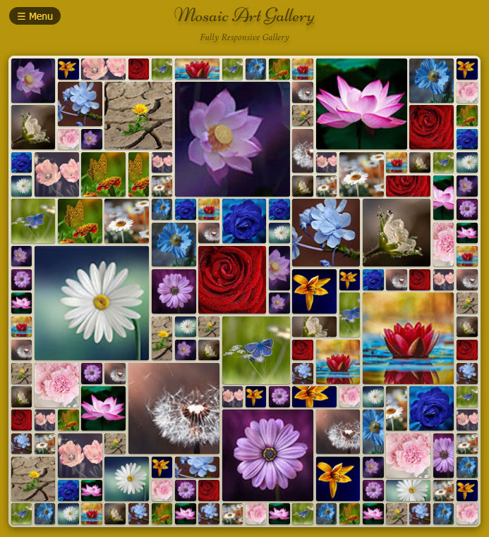

## Demo

You can follow the demo version of the project from the below link:

[Mosaic art gallery demo](https://amin-norollah.github.io/JS-code/Pages/MosaicGallery/)

## Manual

This project is totally written with JS, CSS and HTML. I used CSS and JS for implementing all effects, which have enhanced the performance. Some of the features of the mosaic art gallery are as follows:

- Generating photo album according to the existing images,
- Changing background and font colors in real-time,
- Using lazy loading images which allows the user to see the small blurred image before the image is fully loaded,
- Fully responsive,
- CSS effects.

I tried to make the page look attractive to the user. Feel free to contact me if you have any comments or questions.

> Get in touch with me by [a.norollah.official@gmail.com](mailto:a.norollah.official@gmail.com)

## License

JS-code is licensed under the [MIT license](https://opensource.org/licenses/MIT).
